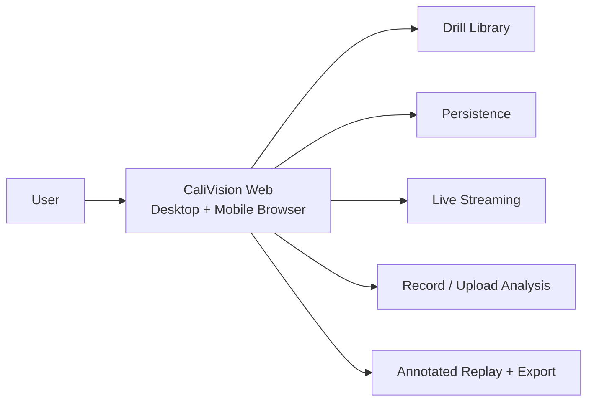

# CaliVision
https://cali-vision-studio.vercel.app

CaliVision is the primary product surface across desktop and mobile browsers.

CaliVision has evolved from the original Android app (built on kotlin/ml kit pose) 
<https://github.com/Voycepeh/CaliVision>
Into todays cross platform webapp (built on typescript, mediapipe, hosted on vercel, with supabase backend and google cloud oauth) 


## Product direction

After further consideration, CaliVision is moving toward a cross-platform web-first architecture.

- Studio is the primary product surface.
- Studio owns drill authoring, drill library workflows, upload analysis, replay/review, and future in-browser mobile camera capture.
- Android is no longer presented as the primary surface for the whole product.
- Android remains an optional native path for premium live coaching or hardware-specific workflows when it proves meaningfully better than the browser.

## Current near-term focus

1. Choose a drill or freestyle mode.
2. Upload a video or capture from a mobile browser camera.
3. Analyze in CaliVision.
4. Review counts, holds, events, and annotated replay.

## A short history of the product

CaliVision started Android-first because on-device live coaching was the initial center of effort.

As the end-to-end workflow expanded (authoring, library management, upload analysis, and review), Android-first ownership no longer fit the broader product journey.

The web app is now the better center of gravity because it provides one cross-platform workflow across desktop and mobile browsers, while Android should be described as legacy and no longer as the main product

## How CaliVision is split

### CaliVision web app (main surface)

- Create and edit drills in Drill Studio
- Manage drafts and saved drills in Library
- Run Upload Video analysis in the browser
- Review replay outputs and analysis details
- Expand to mobile-browser camera capture
- Produce drill definitions used by runtime clients

### Android app (optional native specialization)

- Optional native runtime for live coaching and specialized device capabilities
- Consumption of Studio-authored drill definitions
- Repo: <https://github.com/Voycepeh/CaliVision>

## Main user flows

### 1. Drill authoring flow

Library -> open or create drill -> edit phases and poses in CaliVision -> save to library.

### 2. Upload and capture analysis flow

Library or Upload Video -> choose drill or freestyle -> upload video or capture from mobile browser camera -> run analysis in CaliVision -> review outputs, replay, and results.

### 3. Optional Android runtime flow

Create and manage drill in CaliVision -> use, export, or sync drill to Android app -> start optional live coaching session on device.

### 4. Library and review flow

Browse drills and drafts -> continue editing, run analysis, or review annotated replay and events.

## System view



## Current capabilities

### CaliVision web app today

- Drill authoring in Studio
- Drill and draft management in Library
- Browser-based Upload Video analysis
- Review and replay outputs in browser workflows
- Export and compatibility workflows for runtime clients

### Android app today

- Optional on-device live coaching runtime
- Consumption of Studio-authored drill definitions

See Android repo for runtime details: <https://github.com/Voycepeh/CaliVision>

## Repo quick start

```bash
npm install
npm run dev
```

Open <http://localhost:3000>.

## Documentation notes

For package specs, compatibility details, and low-level contract behavior, use the docs in `docs/`.

## Scope discipline

This README is a product and user-flow map first. Keep detailed implementation and contract notes in `docs/`, schema files, compatibility docs, and samples unless those details are required to explain user flow.
