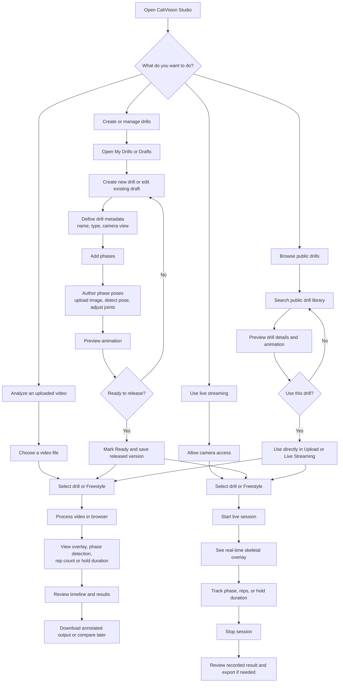
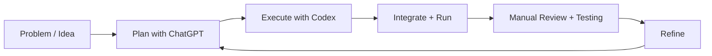

# CaliVision Studio
CaliVision Studio is the browser-first workspace where drills are authored, analyzed, refined, persisted, and shared.

Live app: <https://cali-vision-studio.vercel.app>

## Why I built CaliVision
I built CaliVision because I wanted help visualizing my handstand stack.

I was already recording training videos and manually replaying them, but I wanted faster and more structured feedback so I could adjust in the next set instead of guessing.

CaliVision also became a practical experiment in AI-assisted building. I come from a data architecture / BI background rather than traditional app development, and I wanted to push an idea into a real product while learning where AI accelerates delivery, where human judgment still matters, and where the limits of AI-assisted development actually are.

## Why Studio exists
Studio exists because the core workflows are broader than a phone-only runtime:

- Upload Video analysis in browser.
- Livestream analysis in browser.
- Drill authoring and iterative phase editing.
- Animation preview and movement refinement.
- Drill file/package management (import/export compatibility).
- Drill Exchange publish/discovery/import workflows.

In short: Studio is the source-of-truth workspace for creating and improving drills, then applying them during analysis.

### Product ecosystem and workflow

## Main capabilities
### Analyze movement (upload + livestream)
- Run skeletal overlay on uploaded videos using MediaPipe.
- Run live stream skeletal overlay in browser.
- Apply a selected drill during analysis so outputs are drill-aware (for example rep counting, hold duration, and phase classification).
- Runtime loop is derived from the authored phase order and auto-closes back to phase 1 (`1 -> 2 -> ... -> 1`).
- Rep drills count only when the full authored loop returns to phase 1; hold drills track the selected hold phase while confidently matched.
- Studio warns when authored phases are visually too similar and may be ambiguous at runtime.

### Author and refine drills
- Create drills/movements in phases.
- Seed and refine phase references from pose detection on uploaded images.
- Preview movement as skeleton animation and iterate quickly.

### Persist and share drills
- Save drafts locally in the browser (IndexedDB-first behavior).
- Sign in with Google and use hosted persistence via Supabase where configured.
- Keep portable drill files/packages for import/export compatibility.
- Publish to Drill Exchange and import shared drills.

## Typical workflow
1. Start in **Library** (`/library`) and choose an existing drill or create/import one.
2. Open **Drill Studio** (`/studio`) to refine phases and pose references.
3. Preview animation, iterate, and validate movement intent.
4. Save as a local draft and/or persist to your signed-in hosted account.
5. Optionally publish to **Drill Exchange** (`/marketplace`) or export a portable drill file.
6. Open **Upload Video** (`/upload`) or livestream mode and select that drill.
7. Review drill-specific outputs such as rep counts, hold timing, and phase classification.

## Persistence and sharing model
- **Local-first is core:** browser-local persistence remains the baseline, including when hosted services are unavailable.
- **Hosted persistence is supported directionally now:** Google sign-in + Supabase are used for first-party hosted draft/account workflows where configured.
- **Portability remains explicit:** drill file/package flows still support import/export and cross-user movement of content.
- **Exchange workflows are part of the product surface:** publish/discover/import flows are included, with maturity varying by route and feature area.

## Relationship to Android
Studio (this repository) is the main cross-platform authoring and analysis workspace.

The Android app is a downstream runtime/mobile companion for native live-coaching and hardware-specific scenarios, not the primary authoring home: <https://github.com/Voycepeh/CaliVision>.

## AI-assisted SDLC (human-in-the-loop)
This project is intentionally built with AI assistance, not autonomous shipping:

- **ChatGPT** helps with planning, tradeoff analysis, and design pressure-testing.
- **Codex** helps execute scoped repository changes and draft implementation updates.
- **Human owner** sets direction, validates behavior, integrates changes, runs tests, and approves what ships.

AI increases speed and leverage; accountability and product judgment remain human responsibilities.

### AI-assisted SDLC


## Quick start
```bash
npm install
npm run dev
```

Open <http://localhost:3000>.

## Concise technical notes
- Next.js + React web app.
- MediaPipe-based pose workflows for browser analysis.
- Local-first persistence with hosted Supabase foundations where configured.
- Single-user-first implementation roadmap: `docs/product/single-user-first-roadmap.md`.
- Keep README focused on product flow and ownership; put low-level contracts and compatibility details in `docs/`.
