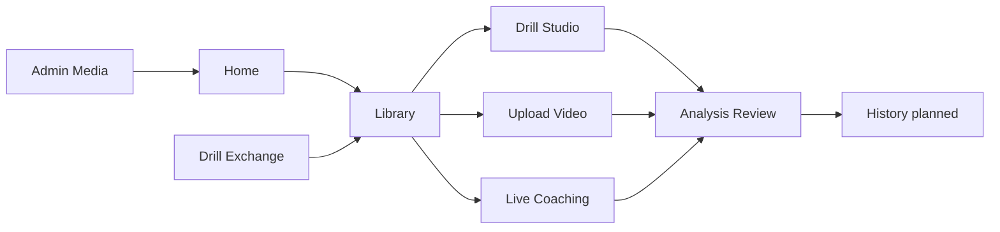

# CaliVision Studio

CaliVision Studio is a browser-first calisthenics motion analysis workspace. It helps athletes and coaches create drill definitions, run upload or live camera analysis, review skeletal overlays, count reps or holds, and turn training videos into clearer feedback.

It is built for athletes training solo, coaches programming drill progressions, and anyone who wants faster movement feedback without stitching together separate tools.

Today, Studio supports the full browser workflow: pick or author drills, upload training footage or run live sessions, and review drill-aware analysis. Next, the roadmap focuses on stronger session history, faster drill access, and tighter analysis review loops.

Live app: <https://cali-vision-studio.vercel.app>

## What the product does

- Create and refine drills in **Drill Studio**.
- Use built-in drills or import from **Drill Exchange**.
- Upload training videos for pose overlay and rep/hold analysis.
- Run live coaching in the browser.
- Review drill-aware feedback after a session.
- Store drills locally when signed out or in Supabase when signed in.
- Use admin-managed media for homepage/product storytelling assets.

## Why I built CaliVision

I built CaliVision because I wanted better feedback on my own handstand stack.

I was already recording training videos and replaying them manually, but I wanted faster, more structured feedback so I could adjust in the next set instead of guessing.

CaliVision also became a practical experiment in AI-assisted building. I come from a data architecture / BI background rather than traditional app development, and I wanted to test where AI accelerates delivery, where human judgment still matters, and where AI-assisted development reaches its limits.

## Product anchor

Studio (this repo) is the active product home for cross-platform browser workflows: create or choose drills, run upload analysis, run live coaching, review drill-aware feedback, and (roadmap) retain progress over time.

The Android app is now legacy/optional runtime context rather than the main maintained product surface. Studio is the primary maintained product. Android repo reference: <https://github.com/Voycepeh/CaliVision>.

## Product flow

CaliVision Studio is organized around one training loop:

**Choose or create a drill → run an upload or live session → review the result → improve the next attempt.**

### 1. Start from Home

The homepage introduces the product and routes users into the main workflows.

Its 7-image carousel is managed through **Admin Media** and tells the product story:

1. Create drills.
2. Use built-ins or Drill Exchange.
3. Upload video.
4. Run live coaching.
5. Review skeletal overlay feedback.
6. Understand reps, holds, and phase results.
7. Track progress over time.

### 2. Choose or manage drills

The **Library** is the default drill workspace. Users can choose built-in drills, manage personal drills, or bring in drills from the **Drill Exchange**.

### 3. Author drills

**Drill Studio** is where users create and refine drills, including movement type, camera view, phase names, and reference poses.

### 4. Analyze movement

Users can analyze movement in two ways:

- **Upload Video** for recorded training footage.
- **Live Coaching** for real-time browser camera feedback.

Both workflows should lead into the same **Analysis Review** experience.

### 5. Review and improve

**Analysis Review** turns the session into understandable training feedback: overlay review, rep or hold results, phase sequence, failed-rep reasons, and coaching cues.

### 6. Retain progress

**History** is the planned surface for saved attempts, personal bests, and progress over time.

## Storage and media model (summary)

- **Local-first mode (signed out):** drafts and workflow state stay in-browser (IndexedDB baseline).
- **Hosted mode (signed in):** Google sign-in + Supabase-backed hosted draft/account flows where configured.
- **Admin media boundary:** homepage/storytelling assets are admin-managed and separate from user-owned training data.
- **Security posture:** secrets (including elevated Supabase keys) remain server-side only.

See [Storage and Media Model](docs/product/storage-media-model.md) for detailed boundaries.

## User journey



## AI-assisted SDLC (concise)

This project uses AI assistance with human ownership:

- ChatGPT: planning and tradeoff analysis.
- Codex: scoped implementation support.
- Human owner: direction, validation, testing, and ship decisions.

## Quick start

```bash
npm install
npm run dev
```

Open <http://localhost:3000>.

## Product docs

- [Page Flow and Ownership](docs/product/page-flow.md): page responsibility map and target user journey.
- [Single-User-First Roadmap](docs/product/single-user-first-roadmap.md): near-term product roadmap focused on the solo training loop.
- [Storage and Media Model](docs/product/storage-media-model.md): local, hosted, admin media, and future session history storage boundaries.

## Concise technical notes

- Next.js + React web app.
- MediaPipe-based pose workflows for browser analysis.
- Local-first persistence with hosted Supabase foundations where configured.
- Keep README focused on product flow and ownership; put low-level contracts and compatibility details in `docs/`.
