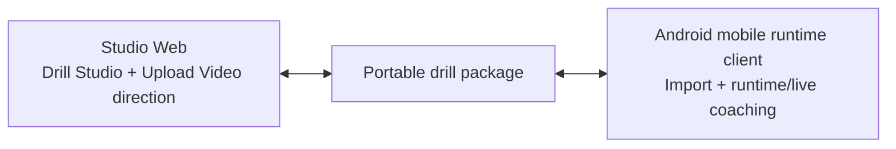
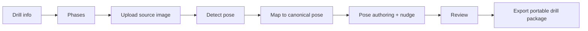
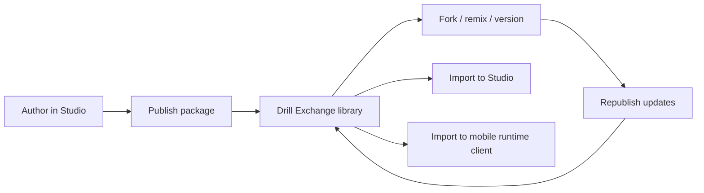
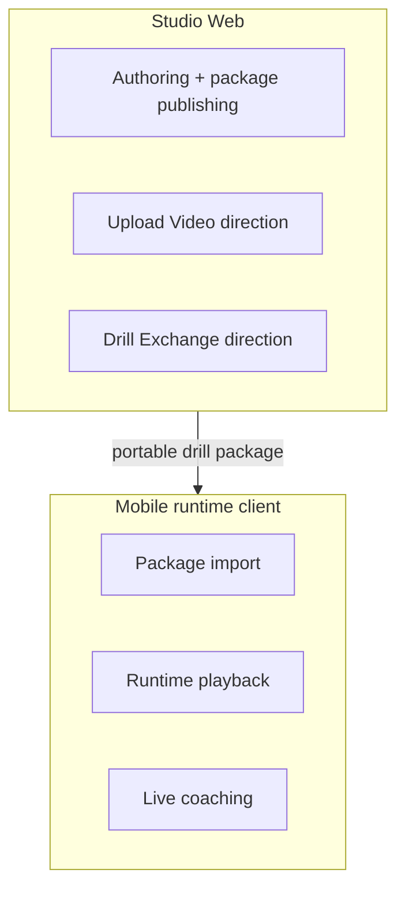
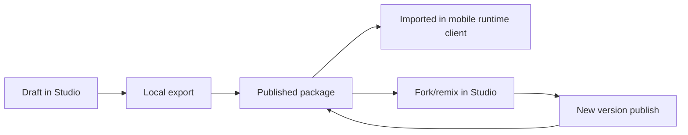

# CaliVision Studio

CaliVision Studio is the **web-first authoring and upload-analysis home** of the CaliVision ecosystem.

It is where drill content is created, edited, refined, previewed, and exported as a **portable drill package** that downstream mobile runtime clients can import and use.

- **Studio repo (this repo):** web authoring, Upload Video direction, package lifecycle, and future Drill Exchange workflows.
- **Android repo:** runtime/live-coaching mobile client — <https://github.com/Voycepeh/CaliVision>.

---

## Product overview

CaliVision Studio exists to make drill authoring visual, iterative, and portable:

- author drills and phases in a browser-native workflow,
- extract pose from phase images and map to canonical package pose format,
- manually refine pose details,
- preview animation before publishing,
- export portable drill packages for Android/mobile import,
- evolve toward hosted sharing, exchange, and package versioning.

Studio is the long-term **source of truth** for drill definitions and package publishing.

---

## Why Studio is web-first

The browser is the right home for **Drill Studio** and **Upload Video** because it provides:

- visual authoring UX with rapid iteration,
- low-friction collaboration and future account-based sharing,
- easier distribution of tooling updates,
- a natural home for media ingest, analysis, and package publishing workflows,
- clear separation from mobile runtime/live-coaching responsibilities.

---

## Ecosystem at a glance



---

## What works now (current target)

Today, the current user story in Studio is:

1. Fill in drill info in the main flow (title/slug/version and other primary metadata).
2. Create, edit, and reorder phases.
3. Upload a source image for the selected phase.
4. Detect pose from the image and map to canonical drill pose format.
5. Manually refine the phase pose with in-context joint controls next to the canvas.
6. Review animation and validation.
7. Export as a portable drill package for Android/mobile import.



Current operational reality is local-first: hosted account storage, cross-user sharing, and backend exchange services are planned but not fully implemented.

Inspector remains available for secondary technical/debug information (internal IDs, asset manifest, validation internals, detection state, and dirty state), while the primary authoring flow no longer depends on Inspector.

---

## What is planned next (future direction)

### Upload Video in browser

- browser-based Upload Video analysis flow,
- drill drafting/reference generation from uploaded media,
- future browser-side or cloud-assisted media processing.

### Drill Exchange and package platform

- login and account ownership,
- save my drill packages in hosted storage,
- publish package versions,
- browse/discover shared drills,
- fork/remix existing packages,
- update and merge forward in a simplified GitHub-like content flow,
- import exchange packages back into Studio and mobile.



---

## Relationship to CaliVision Android

CaliVision ecosystem split:

- **Studio (web, this repo)** = authoring, Upload Video workflows, package publishing/exchange direction.
- **Android mobile runtime client** = package import, runtime playback, and live-coaching consumption.

Android repo: <https://github.com/Voycepeh/CaliVision>.

Mobile apps are downstream consumers of Studio-authored portable drill packages.

---

## Studio/mobile boundary diagram



---

## Package lifecycle diagram



---

## Architecture direction (current)

- **Studio authoring surface**: drill metadata, phase authoring, pose editing/refinement, preview.
- **Portable package contract**: versioned schema for transport/import compatibility.
- **Local-first registry patterns**: local package listing and mock-publish style workflows.
- **Future hosted seams**: auth, storage, exchange indexing, sharing/version graph, collaboration.

See full docs in [`docs/`](docs):

- [`docs/product-overview.md`](docs/product-overview.md)
- [`docs/current-user-flows.md`](docs/current-user-flows.md)
- [`docs/future-user-flows.md`](docs/future-user-flows.md)
- [`docs/system-overview.md`](docs/system-overview.md)
- [`docs/studio-mobile-boundary.md`](docs/studio-mobile-boundary.md)
- [`docs/package-lifecycle.md`](docs/package-lifecycle.md)
- [`docs/drill-exchange-vision.md`](docs/drill-exchange-vision.md)
- [`docs/package-spec.md`](docs/package-spec.md)
- [`docs/android-compatibility.md`](docs/android-compatibility.md)
- [`docs/roadmap.md`](docs/roadmap.md)
- [`docs/pr-plan.md`](docs/pr-plan.md)

---

## Current limitations (honest status)

- hosted auth and user identity are not complete,
- hosted package persistence and cross-user sync are not complete,
- Drill Exchange/community features are directional and not fully shipped,
- upload-analysis backend flows are still evolving,
- local/mock workflows currently stand in for hosted platform services.

---

## Roadmap summary

Near-term direction:

1. deepen Drill Studio authoring and validation quality,
2. formalize browser Upload Video analysis-to-draft workflows,
3. deliver hosted auth/storage and package ownership,
4. launch Drill Exchange with versioning, fork/remix, and discovery,
5. keep Android/mobile import/runtime compatibility stable as Studio evolves.

---

## Quick start

```bash
npm install
npm run dev
```

Open <http://localhost:3000>.
