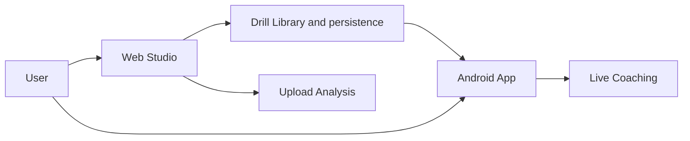

# CaliVision Studio

CaliVision Studio is the browser workspace for authoring drills, managing your drill library, and running upload-video analysis.

CaliVision also includes a separate Android app for edge-device live coaching:
<https://github.com/Voycepeh/CaliVision>

## How CaliVision is split

### Web Studio

- Create and edit drills in Drill Studio
- Manage drafts and saved drills in Library
- Run Upload Video analysis in the browser
- Review outputs and prepare drill data used by runtime clients

### Android app

- Choose drills on device
- Run live coaching sessions on device
- Use drill definitions created, synced, or exported from Studio
- Repo: <https://github.com/Voycepeh/CaliVision>

## Main user flows

### 1. Drill authoring flow

Library -> open or create drill -> edit phases and poses in Studio -> save to library.

### 2. Upload analysis flow

Library or Upload Video -> choose drill -> upload video in browser -> run analysis -> review outputs and results.

### 3. Live coaching flow

Create and manage drill in Web Studio -> use, export, or sync drill to Android app -> start live coaching on device.

### 4. Library flow

Browse drills and drafts -> continue editing, analyze a video, or prepare for Android use.

## System view



## Current product stance

- Android is focused on live coaching.
- Web Studio is the main place for drill creation and upload analysis.
- As the web workflow matures, creation and upload responsibilities should live primarily on web.

## Current capabilities

### Web Studio today

- Drill authoring in Studio
- Drill and draft management in Library
- Browser-based Upload Video analysis
- Export and compatibility workflows for runtime clients

### Android app today

- On-device drill selection and live coaching runtime
- Consumption of Studio-authored drill definitions

See Android repo for runtime details: <https://github.com/Voycepeh/CaliVision>

## Repo quick start

```bash
npm install
npm run dev
```

Open <http://localhost:3000>.

## Documentation notes

For package specs, compatibility details, and low-level contract behavior, use the docs in `docs/`.

## Scope discipline

This README is a product and user-flow map first. Keep detailed implementation and contract notes in `docs/`, schema files, compatibility docs, and samples unless those details are required to explain user flow.
