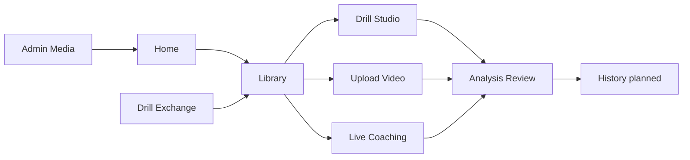
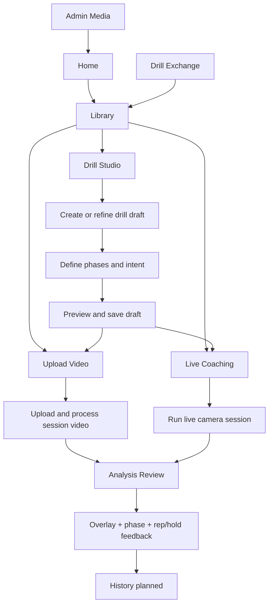

# CaliVision Studio

CaliVision Studio is the **main browser-first workspace** for calisthenics motion analysis.

Live app: <https://cali-vision-studio.vercel.app>

## Why I built CaliVision

I built CaliVision because I wanted help visualizing my handstand stack.

I was already recording training videos and manually replaying them, but I wanted faster and more structured feedback so I could adjust in the next set instead of guessing.

CaliVision also became a practical experiment in AI-assisted building. I come from a data architecture / BI background rather than traditional app development, and I wanted to push an idea into a real product while learning where AI accelerates delivery, where human judgment still matters, and where the limits of AI-assisted development actually are.

## Product anchor

Studio (this repo) is the product home for cross-platform browser workflows: create or choose drills, run upload analysis, run live coaching, review drill-aware feedback, and (roadmap) retain progress over time.

The Android app is a **legacy POC** and is no longer maintained as an active product surface. The cross-platform web app is now the single maintained home of authoring, analysis, and coaching workflows. Legacy repo: <https://github.com/Voycepeh/CaliVision>.

## Current product surfaces

- **Home** (`/`): product entry and storytelling.
- **Library** (`/library`): default workspace start for selecting/organizing drills.
- **Drill Studio** (`/studio`): author and refine drill drafts.
- **Upload Video** (`/upload`): upload-first analysis workflow.
- **Live Coaching** (`/upload?mode=live`): camera/live feedback workflow.
- **Analysis Review**: drill-aware review for overlays, reps/holds, and session interpretation.
- **History** (planned): progress and attempt history over time.
- **Drill Exchange** (`/marketplace`): discovery/import/publish surface.
- **Admin Media** (`/admin/media`): managed branding/media assets (including homepage storytelling assets).

## Homepage story and 7 image carousel

The homepage carousel is a **product storytelling surface**, not just decoration. It explains the end-to-end user journey in one glance.

Carousel images are **admin-managed branding/media assets** so the story can evolve without changing code.

Intended 7 story beats:

1. Create drills.
2. Use built-ins or Drill Exchange.
3. Upload video.
4. Live coaching.
5. Drill-aware overlay feedback.
6. Rep or hold review.
7. Progress over time.

## Storage and media model

- **Local-only mode (signed out):** drafts and workflow state stay in-browser (IndexedDB/local-first baseline).
- **Hosted mode (signed in):** Google sign-in + Supabase-backed hosted draft/account flows where configured.
- **Media foundations:** Supabase Storage + `media_assets` first for homepage/admin branding assets.
- **Site settings:** `app_settings` for runtime-configurable site settings (for example carousel duration).
- **Extension path:** same model can later cover drill reference media, benchmark media, session recordings, generated media, and overlay artifacts.
- **Security posture:** secrets (including elevated Supabase keys) must remain server-side only.

## User journey



## Product ecosystem and workflow



## Near term PR roadmap

1. **PR 1:** README and product plan alignment.
2. **PR 2:** Product docs cleanup and page ownership map.
3. **PR 3:** Storage and media architecture doc.
4. **PR 4:** Homepage product story cleanup.
5. **PR 5:** Analysis review panel redesign.
6. **PR 6:** Session history and saved attempts.
7. **PR 7:** Fast drill access.
8. **PR 8:** Live coaching usability polish.
9. **PR 9:** Personal drill authoring polish.

## AI-assisted SDLC (concise)

This project uses AI assistance with human ownership:

- ChatGPT: planning and tradeoff analysis.
- Codex: scoped implementation support.
- Human owner: direction, validation, testing, and ship decisions.

## Quick start

```bash
npm install
npm run dev
```

Open <http://localhost:3000>.

## Concise technical notes
- Next.js + React web app.
- MediaPipe-based pose workflows for browser analysis.
- Local-first persistence with hosted Supabase foundations where configured.
- Product page ownership and flow map: `docs/product/page-flow.md`.
- Single-user-first implementation roadmap: `docs/product/single-user-first-roadmap.md`.
- Keep README focused on product flow and ownership; put low-level contracts and compatibility details in `docs/`.
