# Current User Flows (Available Now)

This document describes the current target workflow in **Drill Studio**.

## Primary authoring flow

1. Create a new portable drill package.
2. Edit package/drill metadata.
3. Add, edit, and reorder drill phases.
4. Upload a phase image.
5. Detect pose from the image.
6. Map detection into canonical drill pose format.
7. Manually refine pose points.
8. Preview drill animation across phases.
9. Export package for Android/mobile import.

## Mermaid: current Studio workflow

```mermaid
flowchart LR
    A[Create drill package] --> B[Edit metadata]
    B --> C[Create / edit / reorder phases]
    C --> D[Upload phase image]
    D --> E[Detect pose]
    E --> F[Map to canonical drill pose]
    F --> G[Manual pose refinement]
    G --> H[Animation preview]
    H --> I[Export portable drill package]
    I --> J[Import into mobile runtime client]
```

## Current operational notes

- Workflow is local-first in current posture.
- Contract compatibility with Android/mobile import must remain stable.
- Hosted account persistence and exchange sharing are future phases.

Android runtime client reference: <https://github.com/Voycepeh/CaliVision>.
