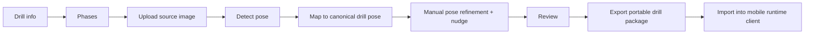

# Current User Flows (Available Now)

This document describes the current target workflow in **Drill Studio**.

## Primary authoring flow

1. Start in Drill info and set primary metadata in the authoring flow.
2. Add, edit, duplicate, delete, and reorder drill phases.
3. Upload a source image for the selected phase.
4. Detect pose from the image.
5. Map detection into canonical drill pose format.
6. Manually refine pose points with joint nudge controls next to the canvas.
7. Review animation and validation.
8. Export package for Android/mobile import.

## Mermaid: current Studio workflow

## Current operational notes

- Workflow is local-first in current posture.
- Contract compatibility with Android/mobile import must remain stable.
- Package and drill internal IDs are system-managed and surfaced as read-only technical details.
- Inspector is now secondary for debug/technical internals, not the primary authoring path.
- Hosted account persistence and exchange sharing are future phases.

Android runtime client reference: <https://github.com/Voycepeh/CaliVision>.
