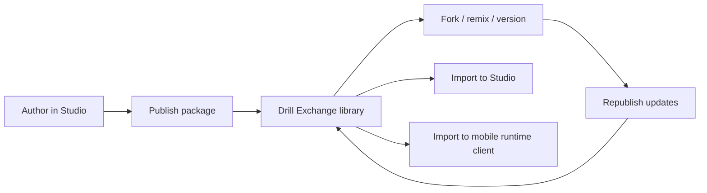

# Future User Flows (Planned)

This document captures planned flows, not guaranteed implementation commitments.

## Upload Video flow (planned)

1. User uploads video in browser.
2. System analyzes motion/poses over time.
3. User extracts candidate key poses/phases.
4. User converts analysis into draft drill/package content.
5. User refines in Drill Studio and publishes/exports.

## Drill Exchange flow (planned)

1. User logs in.
2. User saves owned packages in hosted library.
3. User publishes versioned package.
4. Other users discover and import package.
5. Users fork/remix and publish derived versions.
6. Users manage updates/versions with simplified GitHub-like model.
7. Packages flow back into Studio editing and mobile runtime use.

## Mermaid: future ecosystem workflow

## Future platform dependencies

- hosted auth and account ownership,
- hosted storage/indexing/search,
- version graph and package lineage tooling,
- moderation/governance decisions for shared content,
- potential browser-side and cloud-assisted media processing support.

Android runtime client reference: <https://github.com/Voycepeh/CaliVision>.
