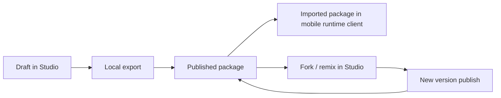

# Package Lifecycle

## Purpose

Define how a portable drill package moves across authoring, publishing, and consumption workflows.

## Mermaid: package lifecycle

## Lifecycle stages

1. **Draft in Studio**
   - author drill metadata/phases/poses.
2. **Local export**
   - generate portable package artifact.
3. **Published package** (future hosted path)
   - package is available in Drill Exchange/library context.
4. **Imported package**
   - mobile runtime client imports package for use.
5. **Fork/remix + new version**
   - user derives or versions package and republishes.

Android runtime client reference: <https://github.com/Voycepeh/CaliVision>.
