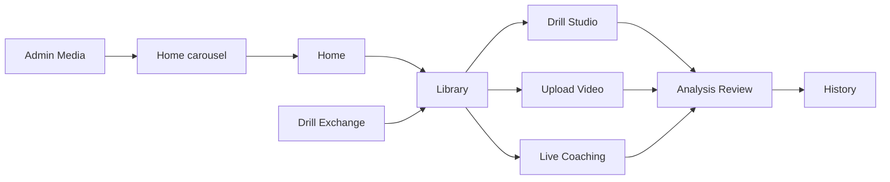

# Page Flow and Ownership

## Purpose
This document defines the intended user journey and page responsibility boundaries for CaliVision Studio so product ownership stays clear across routes.

CaliVision Studio is the browser-first calisthenics motion analysis workspace and source of truth for drill authoring, analysis, and sharing. The Android runtime/live-coaching app remains a companion client rather than the primary authoring workspace: <https://github.com/Voycepeh/CaliVision>.

## Product navigation principle
Every page should have one primary job. Users should always know whether they are choosing a drill, editing a drill, running analysis, reviewing results, or managing content.

## Target user journey
Home
→ Library
→ Drill Studio / Upload Video / Live Coaching
→ Analysis Review
→ History

Additional product feed-ins:
- Drill Exchange → Library
- Admin Media → Home carousel

## Page ownership map

| Page | Route | Primary job | Owns | Should not own | Status |
| --- | --- | --- | --- | --- | --- |
| Home | `/` | product introduction and routing | homepage messaging; 7 image carousel storytelling; entry cards to Library, Upload Video, Live Coaching | deep drill management; analysis review; admin configuration | active |
| Library | `/library` | user drill home | My Drills; built-in drills; recent drills planned; favorites planned; import/export entry points; open drill in Studio; send drill to Upload or Live | detailed phase editing; runtime analysis result review; public marketplace browsing depth | active, needs fast access polish |
| Drill Studio | `/studio` | drill authoring and refinement | drill metadata; movement type REP/HOLD; camera view; phase names and order; pose references; skeleton animation preview; readiness validation; benchmark/reference creation on ready/publish | session history; runtime playback review; marketplace discovery | active, needs authoring polish |
| Upload Video | `/upload` | analyze uploaded video with selected drill | file selection; drill selection for upload; browser processing state; handoff to shared analysis review | drill authoring; long-term history display; deep diagnostics as default view | active, needs result review cleanup |
| Live Coaching | `/live` | real-time camera coaching | camera permission/session controls; live overlay; live rep/hold/phase state; post-session handoff to shared analysis review | drill authoring; admin media; full marketplace browsing | active, needs HUD/usability polish |
| Analysis Review | currently embedded in Upload and Live result screens | make analysis understandable after a run | rep review; hold review; phase sequence review; failure reason; summary coaching cues; diagnostics collapse | video acquisition; drill editing; marketplace publishing | target shared product surface |
| History | planned, likely `/history` or per-drill history under `/library` | retain progress over time | saved attempts; per-drill attempt summaries; personal bests; recent attempts; trend signals | raw authoring; admin settings; public discovery | planned |
| Drill Exchange | `/marketplace` | discover and import shared drills | public drill discovery; preview public drill; add to my library; moderation/admin actions where already supported | default training path; direct runtime selection before import; social/community features for now | active but deprioritised for single-user-first MVP |
| Admin Media | `/admin` | admin management of product/media assets | homepage branding images; carousel media management; carousel duration setting if implemented there; future reusable media asset management | normal user drill authoring; normal user session review; training workflow | active foundation |

## Route cleanup rules
1. Avoid multiple pages doing the same primary job.
2. “Packages” should remain an internal/portable file concept, not a main user-facing page concept.
3. Drill Exchange is not the default training path.
4. Upload and Live should share analysis review language.
5. Technical traces should be diagnostics, not the main result view.
6. Admin workflows should stay out of the normal training journey.

## Current cleanup opportunities
1. Make Analysis Review a shared surface across Upload and Live.
2. Add History to close the training loop.
3. Add recents/favorites to reduce drill selection friction.
4. Keep Home focused on story and routing.
5. Keep Library as the main drill hub.
6. Keep Drill Studio as the only place for detailed drill authoring.
7. Keep Admin Media as the foundation for homepage carousel first, then future drill/session/generated media.

## Non-goals for this PR
1. No UI implementation.
2. No route changes.
3. No database changes.
4. No component refactor.
5. No analysis algorithm changes.

## Acceptance criteria
1. `docs/product/page-flow.md` exists.
2. It clearly defines the target app journey.
3. It clearly states what every major page owns and should not own.
4. It includes a mermaid diagram.
5. README links to the new doc if appropriate.
6. No app behavior changes.
7. No tests should be required beyond markdown/link sanity.
8. PR is opened against `main`.
