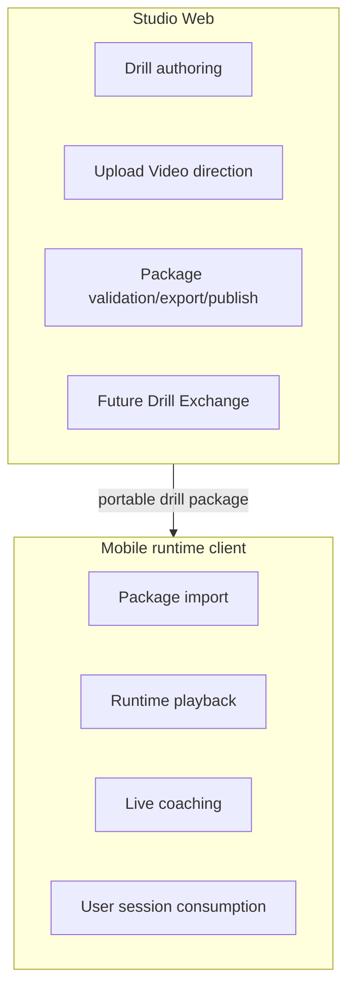

# Studio-Mobile Boundary

## Boundary statement

CaliVision-Studio is the **source of truth** for drill/package authoring and publishing.
Mobile apps are **runtime consumers** of Studio-authored packages.

Android repo: <https://github.com/Voycepeh/CaliVision>.

## Mermaid: boundary diagram

## Engineering implications

- keep portable package contracts stable,
- keep schema evolution explicit/versioned,
- avoid embedding mobile runtime logic into Studio,
- ensure Studio docs reflect what is implemented vs planned,
- preserve Android compatibility whenever contracts/semantics change.
