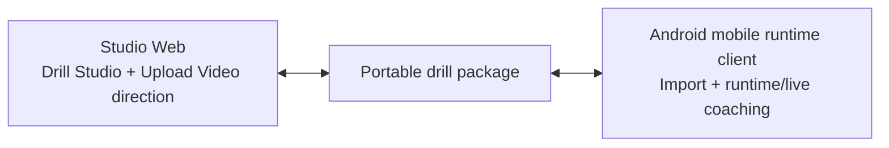

# System Overview

## Ecosystem model

CaliVision is split into a web-first authoring system and a mobile runtime consumer.

- **CaliVision-Studio (this repo):** authoring + upload-analysis direction + publishing/exchange direction.
- **CaliVision Android:** runtime/live-coaching mobile client. <https://github.com/Voycepeh/CaliVision>

## Mermaid: ecosystem overview

## System responsibilities

### Studio web responsibilities

- drill package authoring and editing,
- phase/pose authoring workflows,
- image pose detection and refinement,
- animation preview,
- package export/publish workflows,
- future Drill Exchange features.

### Mobile runtime client responsibilities

- package import/use,
- runtime execution and live coaching,
- on-device user consumption experience.

## Data and backend posture

Current direction remains local-first/mock-first for several platform concerns.
Hosted auth, storage, and exchange services are planned as future backend layers.
